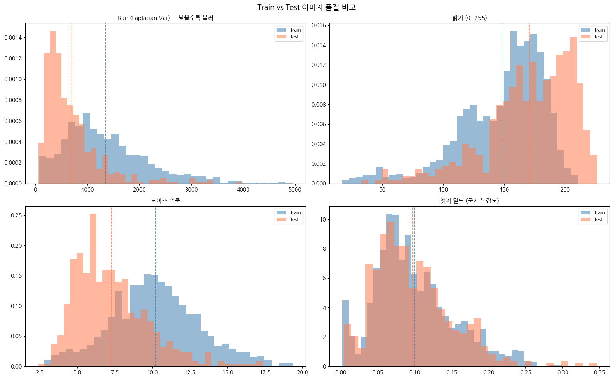
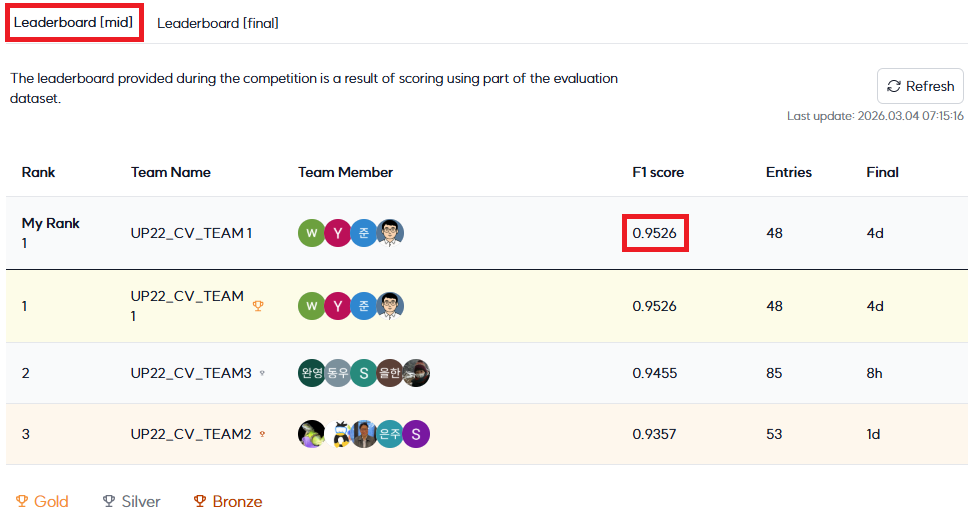
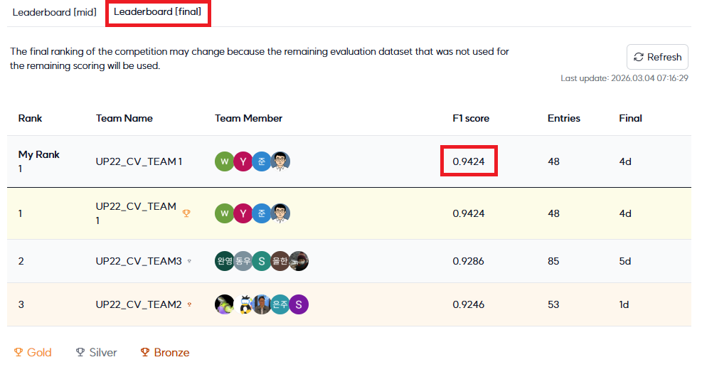

# Document Type Classification 대회 (Upstage AI Lab 22기 CV 1팀)

## Team

|  |  |  |  |
| :---------------------------------------------------------------------------------------------: | :-------------------------------------------------------------------------------------------: | :--------------------------------------------------------------------------------------------: | :-------------------------------------------------------------------------------------------: |
|                                [김원재](https://github.com/owenkim0219)                                |                              [윤준](https://github.com/jun-yoon1)                               |                               [전호열](https://github.com/hyjeon1985)                                |                              [정윤](https://github.com/yoon-chung)                               |
|                                대회 코드 작성<br/>발표자료 작성                                |                              대회 코드 작성                               |                               대회 코드 작성<br/>코드 저장소 관리                                |                              EDA 및 실험 설계<br/>대회 코드 작성<br/>**_*최종 리더보드 1위*_**                               |

## 0. Overview

본 저장소는 Upstage AI Lab 22기 CV Team 1의 문서 타입 분류 대회 협업 결과를 정리한 대회 결과 산출물 저장소입니다.
대회 기간 동안 수행한 EDA, 모델링, 검증, 제출 전략을 재현 가능한 형태로 정리·보존하는 것을 목표로 합니다.

### Key Highlights

- 대회 과제: 17개 문서 타입 이미지 분류(Macro F1)
- 대회 최고점 지표(Mid/Final): **0.9526** / **0.9424**
- 대회 최고점 전략: EfficientNet-B3 + ConvNeXt-Small 이종 백본 앙상블, 10-view TTA, 가중치 소프트 보팅 최적화
- 실험/운영 원칙: 팀 공통 개발 환경 + 멤버별 실험 공간 분리 + 재현 중심 아카이브 관리

### Environment

- 본 프로젝트는 `members/<github_id>/` 경로를 기준으로 멤버별 작업공간을 분리하여 운영합니다.
- 공용 루트 구성은 최소화하고, 실험 설정 및 산출물은 각 멤버 폴더 내부에서 관리합니다.
- 개발 환경 및 실행 규칙은 팀 공통 기준으로 통일하여 운영합니다.

### Requirements

- Python 3.10 환경을 기준으로 합니다.
- CUDA 지원 GPU 환경을 권장합니다.
- 의존성은 루트 `requirements.txt`를 단일 기준으로 관리합니다.
- 초기화 절차는 다음과 같습니다.

```bash
bash bootstrap.sh
source .venv/bin/activate
```

실행 방법은 리더보드 최고점 전략 재현 흐름으로 설명합니다.

```bash
# 노트북은 members/yoon-chung/src 기준 상대경로를 사용합니다.
cd members/yoon-chung/src

# 1) EDA
# - 데이터 분포 및 train/test 품질 차이(회전/블러/노이즈)를 확인합니다.
jupyter notebook 00_eda.ipynb

# 2) 실험 설계 및 비교
# - K-Fold/Hard Validation, 백본 비교, 증강 전략, TTA 구성을 실험합니다.
jupyter notebook 01_main.ipynb

# 3) 최종 파이프라인(전체 데이터 학습 → 추론 → 제출)
# - 384 입력, 이종 백본 앙상블, 10-view TTA, 가중치 소프트 보팅을 적용하여 제출 파일을 생성합니다.
jupyter notebook 02_main_total.ipynb
```

## 1. Competition Info

### Overview

- 과제: 17개 문서 타입 이미지 분류
- 데이터 규모: Train 1,570장 / Test 3,140장
- 평가 지표: Macro F1
- 주요 난점: Train-Test 도메인 갭(회전, 블러, 노이즈, 밝기 변화)

### Timeline

- 대회 기간: 2026-02-19 10:00 ~ 2026-03-03 23:59 (KST)
- GPU 서버 운영: 2026-02-19 10:00 ~ 2026-03-25 16:00 (KST)
- 진행 흐름: EDA → 모델링/검증 → 추론/앙상블 → 제출 → 회고/정리

## 2. Components

### Directory

```text
.
├── bootstrap.sh                     # 공용 환경 부트스트랩
├── requirements.txt
├── members/
│   ├── README.md
│   ├── <github_id>/                 # 멤버별 실험 파이프라인
│   │   ├── configs/
│   │   ├── scripts/
│   │   ├── src/
│   │   ├── outputs/
│   │   └── archive/
│   └── yoon-chung/                  # 리더보드 최고점 전략 실험/문서 아카이브
│       ├── README.md
│       ├── src/
│       ├── images/
│       └── outputs/
├── docs/
└── ...
```

## 3. Data Description

### Dataset overview

- 학습 데이터(`train/`): 총 1,570장의 이미지로 구성됩니다.
- 정답 라벨(`train.csv`): `ID`(파일명), `target`(정답 클래스 번호) 컬럼을 포함합니다.
- 클래스 정보(`meta.csv`): `target`(클래스 번호), `class_name`(클래스명) 컬럼을 포함합니다.
- 평가 데이터(`test/`): 총 3,140장의 이미지로 구성됩니다.
- 제출 템플릿(`sample_submission.csv`): `ID`, `target` 컬럼을 포함합니다(`target` 기본값 0).
- 평가 데이터는 학습 데이터 대비 회전/반전 및 훼손 이미지가 포함되어 도메인 갭이 존재합니다.
- 원본 데이터는 비공개를 원칙으로 하므로, Git 저장소에 포함하지 않습니다.

### EDA

EDA 기준의 핵심은 다음과 같습니다.
- 클래스 불균형(특히 class 1/13/14)
  
- 문서 비율 및 방향 다양성(가로/세로 혼재)
  
- 테스트셋의 품질 열화 특성(회전/블러/노이즈)
  

### Data Processing

모델별 증강을 분리 적용하는 전략을 채택하였습니다.
- EfficientNet-B3: 강증강(v3) 적용
- ConvNeXt-Small: 상대적으로 보수적인 증강(v2) 적용
- 추론 단계: 10-view TTA(회전/반전 조합) 적용

## 4. Modeling

### Model description

대회 종료 시점 기준 리더보드 최고점 전략 개요는 다음과 같습니다.
- 백본 2종 앙상블: EfficientNet-B3 + ConvNeXt-Small
- 입력 크기: 384x384
- 학습 방식: 전체 데이터 기반 학습(최종 제출용)
- 앙상블 방식: 가중치 소프트 보팅 (B3 0.4 : ConvNeXt 0.6)
- TTA: 10-view

### Modeling Process

- 검증 설계: K-Fold 및 Hard Validation 관점에서 성능을 비교·검증하였습니다.
- 학습 전략: 백본별 증강을 차등 적용하고, 최종 제출은 전체 데이터 학습을 기준으로 구성하였습니다.
- 추론 전략: 10-view TTA 및 소프트 보팅 기반 앙상블을 적용하였습니다.
- 상세 실험 인사이트 및 근거는 [최고점 실험 문서](members/yoon-chung/README.md)에 정리되어 있습니다.

리더보드 최고점 전략 도출까지의 핵심 실험 흐름은 다음과 같습니다.

| Phase | 주요 실험 | 핵심 결론 |
| --- | --- | --- |
| 1 | EfficientNet-B3 단독 실험, 증강 강도 비교, TTA 5-view 시작 | 강한 왜곡 계열 증강은 문서 분류 성능을 저해할 수 있음을 확인 |
| 2 | B3 + ConvNeXt-Small 조합, 전체 데이터 학습 전환, 모델별 증강 분리 | 백본별 최적 증강(B3:v3, ConvNeXt:v2)과 전체 데이터 학습이 유효 |
| 3 | TTA 5→6→8→10-view 확장 | 10-view까지 성능이 점진 개선되어 최종 추론 정책으로 채택 |
| 4 | EfficientNetV2-S, Swin 계열 등 대체 백본 비교 | 데이터 규모/안정성 기준으로 B3 + ConvNeXt 조합 유지 |
| 5 | 소프트 보팅 가중치 탐색(50:50, 45:55, 40:60, 35:65) | **B3:ConvNeXt = 0.4:0.6**이 최고점 달성 |
| 6 | 혼동 클래스(class 3↔7, 14↔4) 보정 시도 | 라벨 교정/보조 분류기는 제한적 효과로 최종 조합은 기존 전략 유지 |

## 5. Result

### Leader Board

- 리더보드 1위 달성(Mid/Final): **0.9526** / **0.9424**

  
  
- 상위 성능 달성의 핵심은 다음과 같습니다.
  - 모델 다양성 기반 앙상블(CNN 계열 내 이질적 백본 조합)
  - 모델별 최적 증강 분리 적용
  - 확장 TTA(10-view) 및 가중치 보팅 최적화

### Performance History

최고 제출 점수(0.9526)까지의 주요 개선 이력은 다음과 같습니다.

| 단계 | 주요 변경 | 점수(Mid LB) | 변화 |
| --- | --- | --- | --- |
| Baseline | 초기 기준 모델 | 0.4960 | - |
| Step 1 | EfficientNet-B3 + TTA 5-view | 0.9125 | +0.4165 |
| Step 2 | B3 + ConvNeXt-Small 앙상블, 전체 데이터 학습 | 0.9216 | +0.0091 |
| Step 3 | 모델별 최적 증강(B3:v3, ConvNeXt:v2) | 0.9450 | +0.0234 |
| Step 4 | TTA 10-view 확장 | 0.9516 | +0.0066 |
| Step 5 | 가중치 소프트 보팅 40:60 | **0.9526** | +0.0010 |

### Tried But Not Effective

| 시도 | 결과 | 판단 |
| --- | --- | --- |
| EfficientNet-B4 | 성능 개선 대비 학습 시간 증가폭 큼 | 데이터 규모 대비 비효율 |
| 왜곡 계열 강증강(Elastic/Grid/Optical) | 로컬·리더보드 일관 개선 실패 | 문서 구조 보존 관점에서 부적합 |
| Focal Loss | 기준 손실 대비 유의미한 개선 없음 | 클래스 불균형 조건에서 실효성 낮음 |
| CutMix / MixUp | 문서 특성상 성능 저하 경향 | 텍스트/레이아웃 보존과 충돌 |
| Swin 계열 | 성능·안정성 측면에서 불리 | 데이터 규모 대비 과적합/변동성 이슈 |
| 클래스별 가중치 앙상블/이진 보조분류기 | 혼동 클래스 개선 효과 제한적 | 최종 파이프라인에는 미반영 |

### Presentation

- [발표자료 문서](https://docs.google.com/presentation/d/1d6Bm-ggz77UKCCPpeGqfB6-eBZi3cTzV/edit?usp=sharing&ouid=107119068375712766129&rtpof=true&sd=true)

## Etc

### Meeting Log

- 회의 로그는 팀 협업 채널(Slack, Notion) 기록을 기준으로 관리합니다.
- 주요 결정사항(실험 게이트, 제출 조합, 아카이브 정책)은 문서로 재기록하여 보존합니다.

### Reference

- [최고점 모델 학습 문서](members/yoon-chung/README.md)
