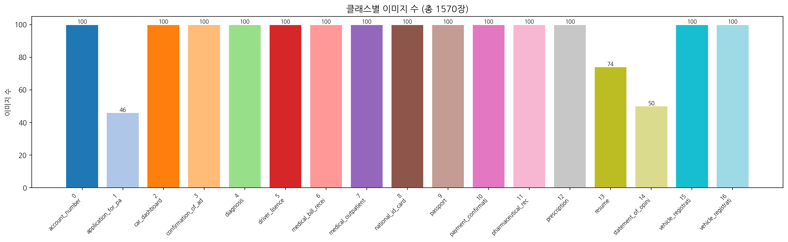
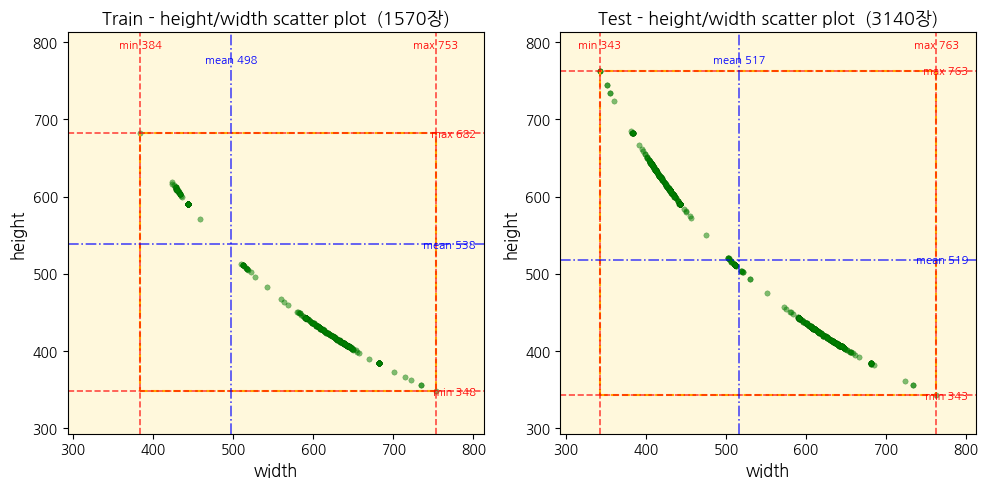
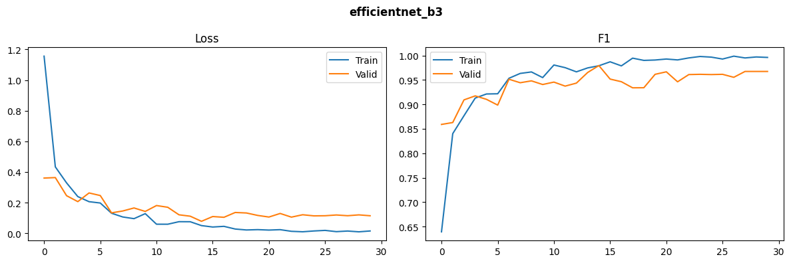
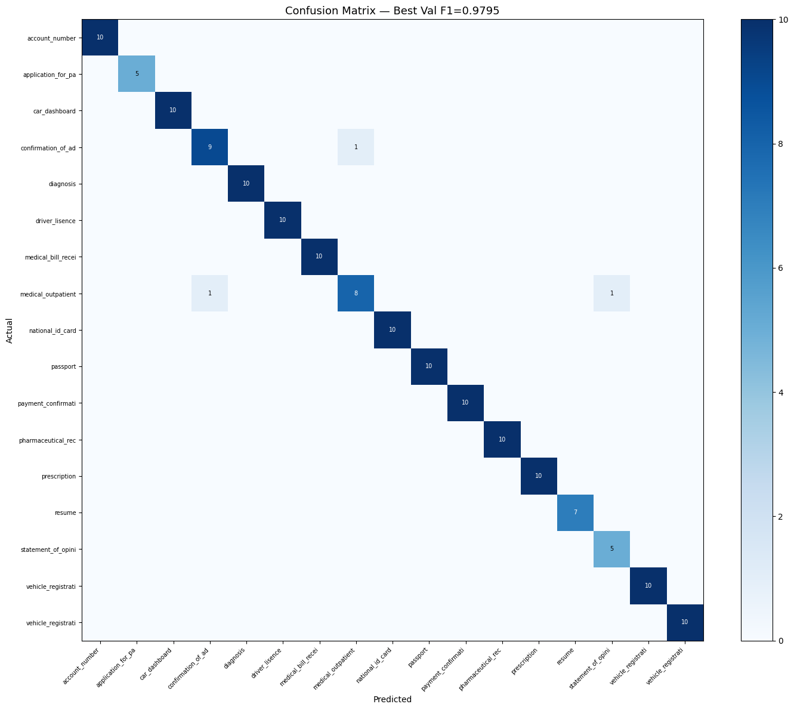
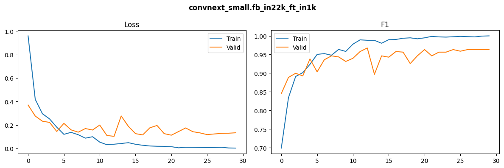
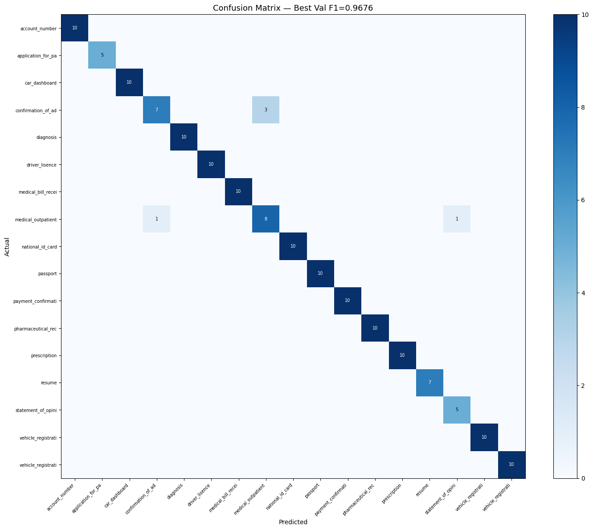

# CV 문서 타입 분류 대회 — 실험 기록 및 전략

> 담당: 정윤 | 기간: 2026.02.19 ~ 03.03 | 최종 LB F1 Score: **0.9526**

---

## 1. 대회 개요

- 과제: 17개 클래스 문서 이미지 분류
- 데이터: Train 1,570장 / Test 3,140장
- 평가지표: Macro F1 Score
- 핵심 난이도: Train-Test 도메인 차이 (회전/블러/노이즈)

---

## 2. EDA 

### 데이터 특성
- 17개 중 3개 클래스 불균형 (class 1: 46장, class 13: 74장, class 14: 50장)


- 사이즈 분포는 Train/Test 비슷, 대각선 형태 = width↑이면 height↓ (반비례) 
- 가로/세로 이미지 문서가 혼재 (class: 0, 2, 5, 6, 8, 9, 11, 16)


- Train vs Test: 회전/noise/blur/brightness정도 차이 심함

### Train vs Test 

| 항목 | Train | Test |
|------|-------|------|
| Rotation | 없음 | 심한 회전 (90°, 180°, 임의 각도) |
| Flip | 없음 | 좌우/상하 뒤집힘 |
| 손상/잘림 | 거의 없음 | 끝단 잘린 이미지 존재 |
| Blur | mean ~1000 | 더 낮음 (더 블러) |
| Noise | mean ~7 | mean ~9 (더 노이즈) |

---

## 3. 전체 실험 타임라인

### Phase 0: 초기 전략 구상

- Resize 전략 (크기 통일)
- Augmentation: RandomRotation, Flip, Cutmix, Mixup (Test 조건 반영)
- 단계별 albumentations: v1 - Rotate/Flip, v2 - Blur/Noise 추가, v3 - Blur/Noise 강도↑, ColorJitter 추가
- Noise Augmentation: GaussianNoise, GaussianBlur
- Class imbalance: Weighted Loss, Focal Loss, Oversampling
- Backbone: EfficientNet, ConvNeXt, Swin Transformer

### Phase 1: CNN 단독모델 + 온라인 증강 + TTA

| 실험 | Val F1 (5-Fold) | LB | 판단 |
|------|:---:|:---:|------|
| EfficientNet-B3, aug v1, TTA 5개 | 0.9349 ± 0.0039 | 0.9125 | 초기전략에 따른 baseline |
| EfficientNet-B3, aug v2 (with 왜곡, Cutmix, Mixup) | 0.9379 ± 0.0048 | 0.9050 | 로컬↑ LB↓, 강한 증강이 해로움 |
| EfficientNet-B4 | 0.9201 ± 0.0150 | - | B3보다 낮고 시간 2.5배, 탈락 |
| EfficientNet-B3, aug v2 (with 왜곡) | 0.9355 ± 0.0087 | - | 왜곡이 문제임을 확인 |
| EfficientNet-B3, focal loss | 0.9305 ± 0.0066 | - | focal loss 효과 없음 |

**Phase 1 핵심 교훈:**
- 강한 왜곡(ElasticTransform, GridDistortion, OpticalDistortion)이 학습을 방해함
- 로컬 Val F1 상승이 LB 상승을 보장하지 않음 (Train-Test 도메인 차이)
- Jupyter 커널 캐싱 문제 발견 → importlib.reload 패턴 도입

### Phase 2: Data Cleansing + 앙상블 + 전체 학습 전환

| 실험 | Val F1 | LB | 판단 |
|------|:---:|:---:|------|
| data cleansing 이후 B3+ConvNeXt | B3 0.9795, Conv 0.9676 | 0.9075 | 9:1 split으로 학습 데이터 10% 감소 |
| B3+ConvNeXt 전체데이터 학습 | Val 0.9853 | 0.9216 | **Val-LB gap 0.064 문제 발생** |
| 오프라인 증강 + 온라인 aug v2 | B3 0.9044, Conv 0.9312 | - | 이중 증강으로 성능 급락 |
| B3 aug v3 + ConvNeXt aug v2 | Val 0.9555 | 0.9450 | **모델별 최적 aug 발견** |
| Swin-Small 추가 (3모델) | Swin 단독 0.9104 ± 0.0227 | - | 불안정, 앙상블 기여도 낮음 |

**Phase 2 핵심 교훈:**
- LB 제출 시 9:1 split보다 전체데이터 학습이 유리함
- 오프라인 증강 + 온라인 증강 이중 적용은 과도한 왜곡을 유발
- B3는 강한 aug v3에 효과적이지만, ConvNeXt는 변형 내성이 강해서 기본 aug v2가 최적
- 로컬-LB gap을 줄이기 위해 Hard Validation 도입 (test 조건 시뮬레이션)

- B3 로컬 Val



- ConvNeXt 로컬 Val




### Phase 3: TTA 확장 최적화
- 회전 4개:  원본, 90°, 180°, 270°        
- 뒤집기 4개: HFlip(좌우 거울상), VFlip(상하 뒤집기), 대각선↗, 대각선↘ 

| TTA 구성 | LB | 개선 | 비고 |
|------|:---:|:---:|------|
| 5개 (원본+90°+180°+270°+HFlip) | 0.9450 | baseline | |
| 6개 (+VFlip) | 0.9489 | +0.0039 | B3가 회전에 약해서 VFlip이 보완 |
| 8개 (+HFlip+90°, VFlip+90°) | 0.9510 | +0.0021 | 복합변환 추가 |
| 10개 (+HFlip+180°, VFlip+180°) | 0.9516 | +0.0006 | **수렴, 추가 확장 중단** |

### Phase 4: 모델 다양화 시도

| 실험 | Hard Val (5회 평균) | 판단 |
|------|:---:|------|
| EfficientNet-B3 (aug v3) | 0.9398 ± 0.0060 | 기존 유지 |
| ConvNeXt-Small (aug v2) | 0.9498 ± 0.0147 | 기존 유지 |
| EfficientNetV2-S (aug v2) | 0.9277 ± 0.0079 | B3보다 낮고, 같은 CNN 계열이라 앙상블 다양성도 낮음 |
| Swin-Base | 0.8876 ± 0.0105 | 데이터 대비 파라미터 과다(~88M), 과적합 |
| B3+ConvNeXt 앙상블 | 0.9555 ± 0.0070 | **최고 조합** |
| V2-S+ConvNeXt 앙상블 | 0.9462 ± 0.0054 | B3+ConvNeXt보다 낮음 |

### Phase 5: 앙상블 가중치 최적화

| 가중치 (B3:ConvNeXt) | LB | baseline 대비 변경 |
|:---:|:---:|:---:|
| 50:50 | 0.9516 | 0장 |
| 45:55 | 0.9525 | 18장 |
| **40:60** | **0.9526** | **26장** |
| 35:65 | 0.9499 | 43장 |
| 30:70 | - | 미제출 |

- Hard Val 기준 ConvNeXt(0.9498) > B3(0.9398): ConvNeXt에 가중치를 더 부여한 것이 효과적

### Phase 6: 혼동 클래스 해결 시도

#### 라벨링 오류 제거
- 자주 틀리는 샘플 확인 후 7개 교정 후 재학습: 5개 수정(class 3 - 2개, class 4, 7, 14 - 각 1개), 2개 제거(class 13 이력서 - 제목 없고 일부페이지만 포함)

#### 혼동 클래스
- class 3(입퇴원확인서) ↔ class 7(진료통원확인서): 서류 양식 유사, 양방향 혼동
- class 14(소견서) → class 4(진단서): 의료서류끼리 혼동

| 실험 | 결과 | 판단 |
|------|------|------|
| 클래스별 가중치 앙상블 (강한 모델에 +0.1/0.15) | Val F1 동일, 0장 차이 | 효과 없음 |
| 이진분류 모델 (EfficientNet-B0, class 3 vs 7) | Val Acc 0.70 | 효과 없음 |

- class 3 ↔ 7은 시각적으로 너무 유사해서 모델 수준에서 해결이 어려운 문제
- 불확실 샘플 59장 중 margin < 0.1이 26장으로, 앙상블(0.77)보다 이진분류 모델 정확도(0.70)가 낮아 오히려 악화 가능

---

## 4. 최종 아키텍처

### 모델 구성

| 구성 요소 | 설정 |
|-----------|------|
| 모델 1 | EfficientNet-B3, ImageNet-1K pretrained |
| 모델 2 | ConvNeXt-Small, ImageNet-22K→1K pretrained |
| 이미지 크기 | 384×384 |
| 학습 | 전체데이터(1,568장), 30 epochs |
| Optimizer | AdamW (B3: lr=3e-4, ConvNeXt: lr=1e-4) |
| Scheduler | CosineAnnealingLR (eta_min=1e-6) |
| Loss | Weighted CrossEntropyLoss |
| 앙상블 | Weighted Soft Voting (B3 0.4 : ConvNeXt 0.6) |
| TTA | 10개 변환 |

### Augmentation 설정

**B3: aug v3 (강한 증강)**
- Resize(384) + HFlip + VFlip + Rotate(180°)
- GaussianBlur, GaussNoise, RandomBrightnessContrast
- ColorJitter, ShiftScaleRotate, CoarseDropout

**ConvNeXt: aug v2 (기본 증강)**
- Resize(384) + HFlip + VFlip + Rotate(180°)
- GaussianBlur, GaussNoise, RandomBrightnessContrast

**TTA 10개 변환:**
원본, 90°, 180°, 270°, HFlip, VFlip, HFlip+90°, VFlip+90°, HFlip+180°, VFlip+180°

---

## 5. 성능 개선 히스토리

```
02.24  LB 0.4960  | Baseline
02.24  LB 0.9125  │ EfficientNet-B3, Split 9:1, TTA 5개
02.26  LB 0.9216  │ EfficientNet-B3+ConvNeXt-Small 앙상블, 전체학습 전환 (+0.0091)
02.27  LB 0.9450  │ data cleansing, 모델별 최적 aug (B3:v3, ConvNeXt:v2) (+0.0234)
02.27  LB 0.9489  │ TTA 6개 (+0.0039)
02.27  LB 0.9510  │ TTA 8개 (+0.0021)
02.27  LB 0.9516  │ TTA 10개 (+0.0006)
02.27  LB 0.9499  │ Weighted Soft Voting 35:65 
02.27  LB 0.9525  │ Weighted Soft Voting 45:55 
02.27  LB 0.9526  │ Weighted Soft Voting 40:60 (+0.0011)
─────────────────────────────────────────────
       총 개선: +0.4566 (0.4960 → 0.9526)
```

---

## 6. 시도했으나 효과 없었던 것

| 시도 | 결과 | 이유 |
|------|------|------|
| EfficientNet-B4 | Val -0.014 | 시간 2.5배, 과적합 |
| aug v2 왜곡(ElasticTransform, GridDistortion, OpticalDistortion) | LB -0.0075 | 문서 이미지에 부적합 |
| Focal Loss | Val -0.0044 | 불균형이 심하지 않아 효과 없음 |
| CutMix / MixUp | Val -0.0024 | 문서 이미지 특성상 부적합 |
| 오프라인 증강(Rotate/Blur/Noise + 오버샘플링) | Val -0.03 | 온라인 증강과 이중 적용되어 과도한 왜곡 |
| Swin-Small / Swin-Base | Val 0.91 / 0.89 | 작은 데이터셋 규모로 ViT 계열 불안정 |
| EfficientNetV2-S | Val 0.9277 | B3(0.9398)보다 낮고 같은 CNN 계열로 앙상블 효과 없음 |
| 클래스별 가중치 앙상블 | 0장 차이 | 혼동 클래스가 적어 효과 없음 |
| 이진분류 모델 (class 3 vs 7) | Val Acc 0.70 | 시각적 유사도가 너무 높아 분리 불가 |

---

## 7. 핵심 인사이트

### 데이터가 적을 때의 전략
1,570장이라는 적은 데이터에서는 CNN 계열 모델이 Transformer 계열 모델보다 효과적. 적당한 크기의 모델(EfficientNet-B3, ConvNeXt-Small)이 큰 모델(EfficientNet-B4, Swin-Base)보다 효과적. K-Fold는 평가 도구로만 사용하고, 최종 모델은 전체 데이터로 학습하는 것이 중요.

### Train-Test 도메인 차이 대응
이 대회의 핵심 난이도는 Test 이미지의 회전/블러/노이즈. 이를 해결하기 위해 TTA가 가장 효과적이었고(+0.0066), 모델별 최적 augmentation을 찾는 것(+0.0234)이 가장 큰 개선을 가져옴. Hard Validation을 도입하여 LB와의 상관관계를 높인 것도 실험 효율에 큰 도움.

### 모델 다양성 기반 앙상블
같은 계열(EfficientNet-B3 + EfficientNet-V2-S)보다 다른 계열(EfficientNet + ConvNeXt) 조합이 앙상블 효과가 컸음. 또한 모델별로 최적 augmentation이 다를 수 있다는 점을 발견.

---

## 8. 프로젝트 구조

```
members/yoon-chung/
├── src/
│   ├── 00_eda.ipynb         # EDA
│   ├── 01_main.ipynb        # 실험 노트북 (K-FOLD, StratifiedShuffleSplit, 모델 비교)
│   ├── 02_main_total.ipynb  # 전체데이터 학습 → 추론 → 제출
│   ├── config.py            # 하이퍼파라미터 & 경로
│   ├── preprocess.py        # 오프라인 증강 함수
│   ├── augmentation.py      # 온라인 증강 (v1/v2/v3) & TTA
│   ├── dataset.py           # Dataset, MixUp, CutMix
│   ├── train.py             # 학습/검증 함수
│   └── inference.py         # TTA 추론, 앙상블
├── images/
├── outputs/
├── data/
├── notebooks/
├── docs/
├── train_v1
└── README.md
```
